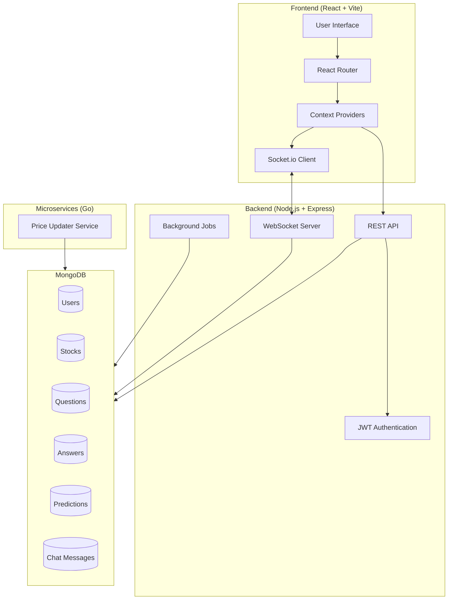
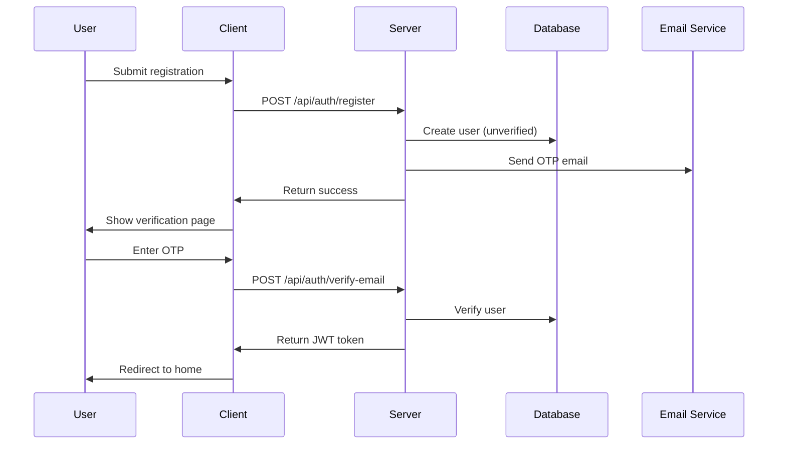
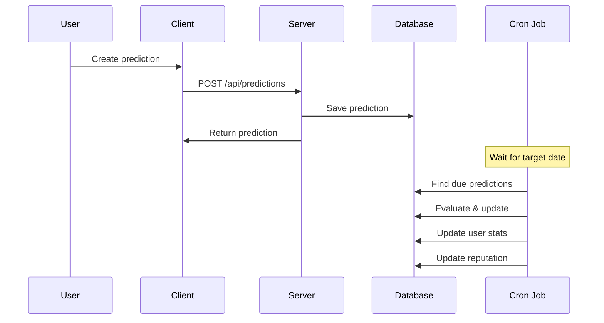

# Architecture Overview

[← Back to Documentation Index](../README.md)

## System Architecture

StockForumX is a full-stack MERN application with real-time capabilities, designed for stock discussions, predictions, and Q&A.



## Technology Stack

### Frontend

- **React 18**: UI library for building interactive interfaces.
- **Vite**: Next-generation frontend tooling.
- **React Router**: Declarative routing.
- **Axios**: Promise-based HTTP client.
- **Socket.io Client**: Real-time event-based communication.
- **Recharts**: Composable charting library.
- **React Hot Toast**: Toast notifications.
- **date-fns**: Modern date utility library.

### Backend

- **Node.js**: JavaScript runtime.
- **Express**: Fast, unopinionated web framework.
- **MongoDB**: NoSQL database.
- **Mongoose**: Elegant Object Data Modeling (ODM).
- **Socket.io**: Real-time engine.
- **JWT**: JSON Web Tokens for stateless authentication.
- **bcryptjs**: Library to help hash passwords.
- **node-cron**: Task scheduler.
- **natural**: General natural language facilities (for similarity detection).
- **express-validator**: Middleware for server-side validation.
- **express-rate-limit**: Basic rate-limiting middleware.
- **nodemailer**: Email sending for Node.js.

### Microservices

> [!NOTE]
> The microservices are built in Go for high performance but are optional for basic development.

- **Go (Golang)**: Statically typed, compiled language.
- **Goroutines**: Lightweight threads for concurrency.
- **go.mongodb.org/mongo-driver**: Official MongoDB driver for Go.

## Project Structure

```text
StockForumX/
├── client/                 # Frontend application
│   ├── src/
│   │   ├── components/    # Reusable components
│   │   │   ├── common/    # Shared components (Navbar, Loader, etc.)
│   │   │   ├── predictions/
│   │   │   ├── questions/
│   │   │   ├── profile/
│   │   │   └── search/
│   │   ├── pages/         # Route pages
│   │   ├── context/       # React Context providers
│   │   ├── services/      # API service layer
│   │   ├── App.jsx        # Root component
│   │   └── main.jsx       # Entry point
│   └── package.json
│
├── server/                # Backend application
│   ├── config/           # Configuration files
│   ├── models/           # Mongoose schemas
│   ├── routes/           # Express routes
│   ├── sockets/          # Socket.io handlers
│   ├── jobs/             # Cron jobs
│   ├── middleware/       # Custom middleware
│   ├── utils/            # Utility functions
│   ├── index.js          # Server entry point
│   └── package.json
│
├── shared/               # Shared constants
└── package.json          # Root workspace config
```

## Core Components

### 1. Authentication System
- JWT-based authentication.
- Email verification with OTP.
- Password reset functionality.
- Login with OTP option.
- Protected routes using middleware.

### 2. Real-time Features
- Live chat per stock room.
- Real-time question/answer updates.
- Live prediction status updates.
- Stock price updates broadcasted to connected clients.

### 3. Reputation System
The reputation score is calculated using the following formula:

`reputation = accuracy × log(totalPredictions + 1) × 100`

**Tiers:**
- **Novice**: 0-9
- **Apprentice**: 10-49
- **Expert**: 50-99
- **Master**: 100-499
- **Legend**: 500+

### 4. Prediction System
- **Price Predictions**: Target price with 5% acceptable margin.
- **Direction Predictions**: Simple Up/Down movement.
- **Timeframes**: 1h, 1d, 1w, 1m.
- **Auto-evaluation**: Cron job evaluates predictions against actual market data.
- **Accuracy Tracking**: Updates user statistics and reputation score.

### 5. Q&A System
- Time-expiring answers (30 days TTL) to ensure freshness.
- Upvoting/downvoting mechanism.
- Accepted answers by question authors.
- Similar question detection using TF-IDF.
- Tag-based organization.

### 6. Background Jobs

#### Prediction Evaluator
- **Schedule**: Every 15 minutes.
- **Function**: Evaluates predictions that have passed their target date.
- **Updates**: User stats and reputation.

#### Reputation Updater
- **Schedule**: Hourly.
- **Function**: Recalculates user reputation for consistency.
- **Creates**: Historical reputation snapshots.

#### Stock Price Updater (Go Microservice)
- **Schedule**: Continuous (High Frequency).
- **Function**: Updates stock prices using concurrent Goroutines.
- **Performance**: Capable of handling hundreds of stock updates simultaneously with low latency.
- **Integration**: Writes directly to MongoDB; changes are broadcasted via WebSocket by the main server.

## Data Flow

### User Registration Flow



### Prediction Flow



## Security Features

1.  **Rate Limiting**: 100 requests per 15 minutes per IP.
2.  **JWT Authentication**: Secure token-based auth for state management.
3.  **Password Hashing**: Arrays using bcrypt with salt.
4.  **Input Validation**: Strict validation using express-validator.
5.  **CORS Protection**: Configured origins to prevent unauthorized access.
6.  **OTP Expiration**: Time-limited verification codes.

## Scalability Considerations

### Database Indexes
- **Stock queries**: `symbol`, `sector`
- **User queries**: `username`, `email`, `reputation`
- **Prediction queries**: `stockId + createdAt`, `userId`, `targetDate + isEvaluated`
- **Question queries**: `stockId + createdAt`, `userId`, `tags`
- **Answer queries**: `questionId + createdAt`, `expiresAt` (TTL)

### Caching Opportunities
- Stock data (5-minute cache).
- Leaderboard (hourly cache).
- Trending questions (15-minute cache).

### WebSocket Rooms
- **Stock-specific rooms**: `stock:{stockId}`
- Reduces broadcast overhead by only sending updates to interested clients.

## Future Enhancements

1.  **Real Stock Data Integration**: Replace mock data with live APIs.
2.  **Advanced Analytics**: More charts and insights.
3.  **Social Features**: Follow users, notifications.
4.  **Mobile App**: React Native version.
5.  **AI Insights**: ML-based prediction analysis.
6.  **Portfolio Tracking**: Virtual portfolio management.
7.  **News Integration**: Stock news aggregation.
8.  **Advanced Search**: Elasticsearch integration.
