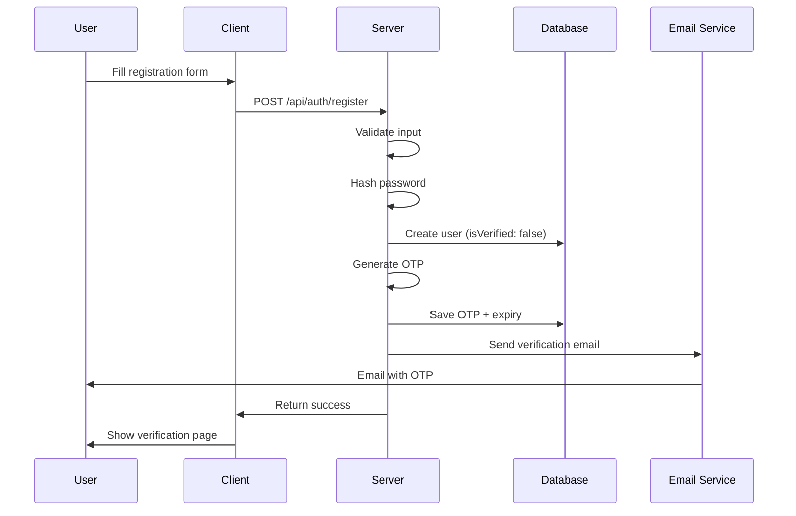

# Authentication System

[← Back to Documentation Index](../README.md)

StockForumX implements a comprehensive authentication system with multiple verification methods.

## Features

- **JWT-based authentication**
- **Email verification** with OTP
- **Login with OTP** (passwordless)
- **Password reset** via email
- **Secure password hashing** (bcrypt)
- **Token-based session management**

## Authentication Flow

### 1. User Registration



**Endpoint:** `POST /api/auth/register`

**Request:**

```json
{
  "username": "johndoe",
  "fullName": "John Doe",
  "email": "john@example.com",
  "password": "SecurePass123!"
}
```

**Response:**

```json
{
  "message": "Registration successful. Please verify your email.",
  "user": {
    "id": "...",
    "username": "johndoe",
    "email": "john@example.com",
    "isVerified": false
  }
}
```

---

### 2. Email Verification

**Endpoint:** `POST /api/auth/verify-email`

**Request:**

```json
{
  "email": "john@example.com",
  "otp": "123456"
}
```

> [!NOTE]
> OTP is a 6-digit code that expires in 10 minutes. It is stored as a hash in the database.

---

### 3. Standard Login

**Endpoint:** `POST /api/auth/login`

**Request:**

```json
{
  "email": "john@example.com",
  "password": "SecurePass123!"
}
```

**Response:**

```json
{
  "token": "eyJhbGciOiJIUzI1NiIsInR5cCI6IkpXVCJ9...",
  "user": {
    "id": "...",
    "username": "johndoe",
    "email": "john@example.com",
    "reputation": 150.5
  }
}
```

> [!IMPORTANT]
> To login, the user must verify their email address.

---

### 4. Login with OTP (Passwordless)

#### Step 1: Request OTP

**Endpoint:** `POST /api/auth/login-otp-init`

**Body:** `{"email": "john@example.com"}`

#### Step 2: Verify OTP

**Endpoint:** `POST /api/auth/login-otp-verify`

**Body:** `{"email": "john@example.com", "otp": "123456"}`

---

### 5. Password Reset

#### Step 1: Request Reset

**Endpoint:** `POST /api/auth/forgot-password`

**Body:** `{"email": "john@example.com"}`

#### Step 2: Reset Password

**Endpoint:** `POST /api/auth/reset-password`

**Body:** `{"email": "john@example.com", "otp": "123456", "newPassword": "NewSecurePass123!"}`

---

## JWT Token Structure

### Token Payload

```json
{
  "id": "user_id_here",
  "iat": 1234567890,
  "exp": 1234654290
}
```

### Token Usage

**Client-Side Storage:**

```javascript
// Store token
localStorage.setItem('token', token);

// Add to requests
axios.defaults.headers.common['Authorization'] = `Bearer ${token}`;
```

**Server-Side Verification:**

```javascript
import jwt from 'jsonwebtoken';

const token = req.headers.authorization?.split(' ')[1];
const decoded = jwt.verify(token, process.env.JWT_SECRET);
const user = await User.findById(decoded.id);
```

---

## Middleware

### Auth Middleware

**File:** `server/middleware/auth.js`

This middleware extracts the token from the header, verifies it, and attaches the user to the request object.

```javascript
import jwt from 'jsonwebtoken';
import User from '../models/User.js';

export const auth = async (req, res, next) => {
    try {
        const token = req.headers.authorization?.split(' ')[1];
        
        if (!token) {
            return res.status(401).json({ error: 'No token provided' });
        }

        const decoded = jwt.verify(token, process.env.JWT_SECRET);
        const user = await User.findById(decoded.id).select('-password');

        if (!user) {
            return res.status(401).json({ error: 'User not found' });
        }

        req.user = user;
        next();
    } catch (error) {
        res.status(401).json({ error: 'Invalid token' });
    }
};
```

---

## Password Security

### Hashing

We use **bcrypt** with a salt round of 10.

```javascript
import bcrypt from 'bcryptjs';

// Pre-save hook in User model
userSchema.pre('save', async function (next) {
    if (!this.isModified('password')) {
        return next();
    }
    
    const salt = await bcrypt.genSalt(10);
    this.password = await bcrypt.hash(this.password, salt);
    next();
});
```

### Validation

> [!TIP]
> Passwords should be at least 8 characters long and contain a mix of uppercase, lowercase, numbers, and symbols.

---

## Email Service

### Configuration

**Environment Variables:**

```env
EMAIL_HOST=smtp.gmail.com
EMAIL_PORT=587
EMAIL_USER=your-email@gmail.com
EMAIL_PASSWORD=your-app-password
EMAIL_FROM=StockForumX <noreply@stockforumx.com>
```

### Implementation

We use `nodemailer` to send transactional emails for verification and password resets.

---

## Security Best Practices

> [!WARNING]
> Security is critical. Follow these best practices in production.

1.  **Environment Variables**: Never commit `.env`. Use a strong `JWT_SECRET`.
2.  **Password Storage**: Never store plain-text passwords.
3.  **Token Management**: Set reasonable expiry times.
4.  **Rate Limiting**: Limit login attempts and OTP requests.
5.  **Input Validation**: Sanitize all user input.
6.  **HTTPS**: Always use HTTPS in production.
