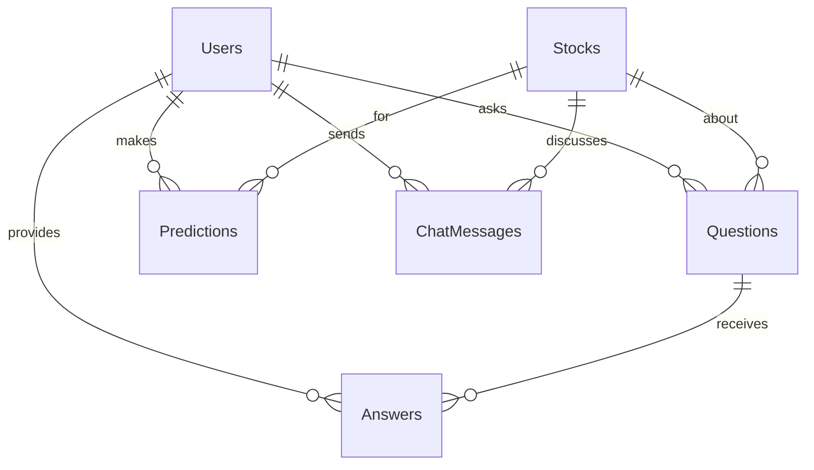

# Database Schema

[← Back to Documentation Index](../README.md)

## Overview

StockForumX uses **MongoDB** with **Mongoose ODM**. The database consists of 7 main collections with relationships and indexes optimized for performance.

## Collections

### 1. Users

Stores user accounts, authentication, and reputation data.

**Key Fields:**
- `username`: Unique, 3-30 chars.
- `email`: Unique, lowercase.
- `password`: Hashed.
- `reputation`: Numeric score.
- `isVerified`: Boolean.

**Indexes:**
- `username` (unique)
- `email` (unique)

---

### 2. Stocks

Stores stock information (currently mock data).

**Key Fields:**
- `symbol`: Unique (e.g., AAPL).
- `currentPrice`: Number.
- `change`: Number.

**Indexes:**
- `symbol` (unique)

---

### 3. Questions

Stores Q&A questions about stocks.

**Key Fields:**
- `stockId`: Reference to Stock.
- `userId`: Reference to User.
- `title`, `content`: Text data.
- `tags`: Array of strings.
- `upvotes`: Counter.

**Indexes:**
- `stockId + createdAt` (compound)
- `userId`
- `tags`

---

### 4. Answers

Stores answers to questions with **TTL (Time To Live)**.

**Key Fields:**
- `questionId`: Reference to Question.
- `expiresAt`: Date (default: 30 days).

**Indexes:**
- `questionId + createdAt`
- `expiresAt` (TTL index)

> [!NOTE]
> **TTL Feature**: MongoDB automatically deletes answers when `expiresAt` is reached, ensuring information freshness.

---

### 5. Predictions

Stores price/direction predictions.

**Key Fields:**
- `predictionType`: 'price' or 'direction'.
- `targetDate`: Auto-calculated based on timeframe.
- `isEvaluated`: Boolean.
- `isCorrect`: Boolean.

**Indexes:**
- `targetDate + isEvaluated` (Critical for cron jobs)

---

### 6. ChatMessages

Stores real-time chat messages.

**Indexes:**
- `stockId + createdAt`

---

### 7. ReputationSnapshots

Stores historical reputation data for tracking charts.

**Indexes:**
- `userId + snapshotDate`

---

## Relationships



## Performance Optimization

### Indexes Strategy

1.  **Compound Indexes**: Used for common query patterns like fetching recent items per stock (`stockId + createdAt`) or finding due predictions (`targetDate + isEvaluated`).
2.  **TTL Index**: Automatically removes old data to keep the `Answers` collection efficient.

### Query Tips

> [!TIP]
> - Use `.select()` to fetch only needed fields.
> - Use `.lean()` for read-only queries to improve performance.
> - Use pagination (limit/skip) for large lists.

## Sample Queries

**Get Top Users by Reputation:**

```javascript
User.find()
  .sort({ reputation: -1 })
  .limit(10)
  .select('username reputation totalPredictions accuracy');
```

**Get Unevaluated Predictions:**

```javascript
Prediction.find({
  isEvaluated: false,
  targetDate: { $lte: new Date() }
})
.populate('stockId userId');
```

## Migration Notes

> [!IMPORTANT]
> When adding new fields to schemas, always create a migration script to update existing documents.

Example migration:

```javascript
await User.updateMany(
  { tradingExperience: { $exists: false } },
  { $set: { tradingExperience: '' } }
);
```
