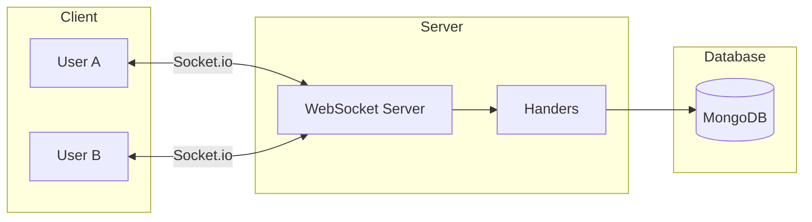

# Real-Time Features

[← Back to Documentation Index](../README.md)

StockForumX uses **Socket.io** for real-time, bidirectional communication between clients and the server.

## Architecture



## Connection Setup

### Server-Side

```javascript
const io = new Server(httpServer, {
    cors: {
        origin: process.env.CLIENT_URL,
        methods: ['GET', 'POST']
    }
});
```

### Client-Side

```javascript
const socket = io('http://localhost:5000', {
    autoConnect: false
});
socket.connect();
```

## Room-Based Architecture

**Room Format:** `stock:{stockId}`

Each stock has its own room. This isolates communication so users only receive updates for the stocks they are currently viewing.

> [!TIP]
> Room-based architecture significantly reduces bandwidth usage by avoiding global broadcasts.

## Events Reference

### Chat Events

| Event | Direction | Description |
|-------|-----------|-------------|
| `join:stock` | Client → Server | Join a stock's room. |
| `leave:stock` | Client → Server | Leave a stock's room. |
| `chat:message` | Client → Server | Send a new message. |
| `chat:typing` | Client → Server | Emit typing status. |

### Update Events

| Event | Direction | Description |
|-------|-----------|-------------|
| `question:new` | Server → Client | New question posted. |
| `answer:new` | Server → Client | New answer posted. |
| `prediction:new` | Server → Client | New prediction made. |
| `stock:update` | Server → Client | Stock price changed. |

## Implementation Example

### Client-Side Chat Component

```javascript
useEffect(() => {
    socket.emit('join:stock', stockId);

    socket.on('chat:message', (message) => {
        setMessages(prev => [...prev, message]);
    });

    return () => {
        socket.emit('leave:stock', stockId);
        socket.off('chat:message');
    };
}, [stockId]);
```

## Performance Considerations

1.  **Room-Based Broadcasting**: Always use `io.to(room).emit()` instead of `io.emit()` whenever possible.
2.  **Throttling**: Debounce high-frequency events like "typing" indicators.
3.  **Connection Pooling**: Monitor the number of concurrent connections per user.

## Security Considerations

> [!WARNING]
> Always verify user identity before processing sensitive socket events.

- **Authentication**: Usage of middleware to attach user context to the socket.
- **Rate Limiting**: Custom implementation to prevent spamming `chat:message` events.
- **Input Validation**: Sanitize all incoming messages before broadcasting.
