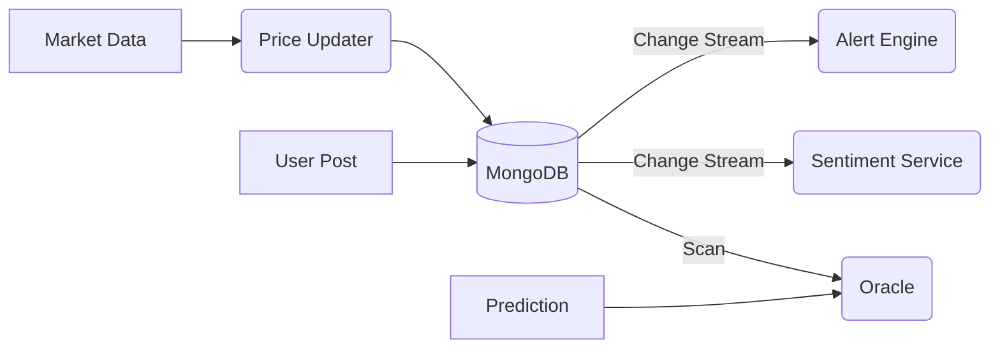

# Microservices Documentation

Stock Forum X uses a distributed microservices architecture to handle high-performance tasks like real-time market data ingestion, notifications, and complex data analytics. While the main API is built with Node.js, specialized services are built with **Go** for maximum concurrency and efficiency.

## Service Catalog

| Service | Language | Description | Trigger Mechanic |
| :--- | :--- | :--- | :--- |
| **Price Updater** | Go | Fetches live stock data from Yahoo Finance and updates MongoDB. | Periodic (Every 1m-5m) |
| **Alert Engine** | Go | Monitors price changes and triggers user-defined alerts. | MongoDB Change Stream |
| **Sentiment Service** | Go | Analyzes forum posts for Bullish/Bearish sentiment using NLP keywords. | MongoDB Change Stream |
| **Analytics Service** | Go | Calculates portfolio diversification and takes periodic worth snapshots. | Periodic / API |
| **Prediction Oracle** | Go | Resolves user predictions by comparing targets with live market data. | Periodic Scanner |

## Architecture Design

### Watcher Pattern

> [!NOTE]
> Most services use MongoDB Change Streams. This allows them to react instantly to data changes without the main backend explicitly triggers them.

Most services follow the **Watcher Pattern** using MongoDB Change Streams. This allows them to react instantly to data changes (like a price update or a new post) without the main Node.js backend having to "call" them, decoupling the systems and improving scalability.

### Data Flow

## Related Documents
- [Go Development & Setup](./GO_DEVELOPMENT.md)
- [Individual Service Configuration](./CONFIG.md)
